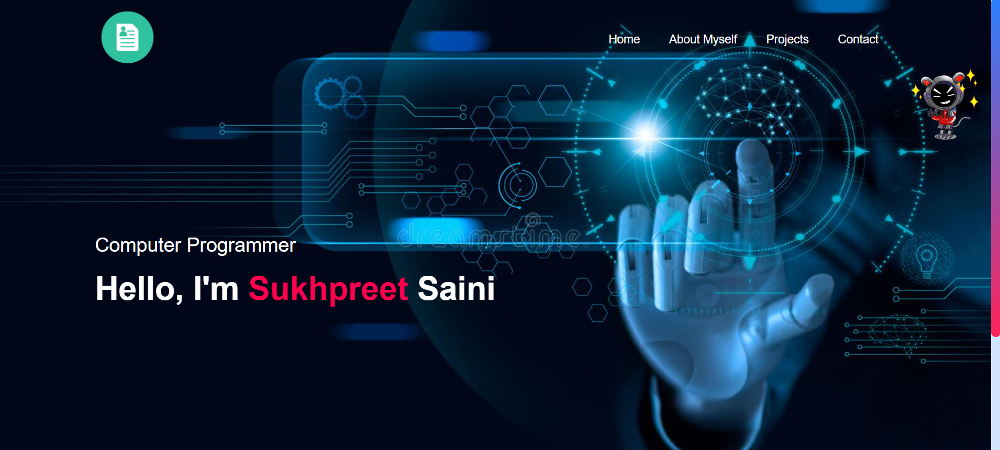
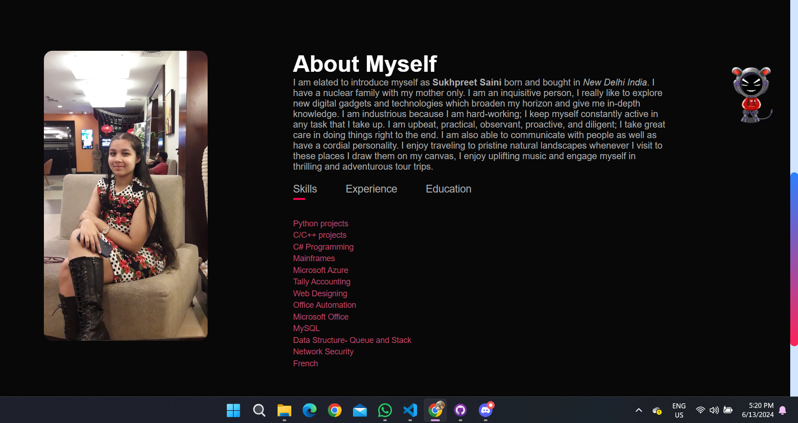
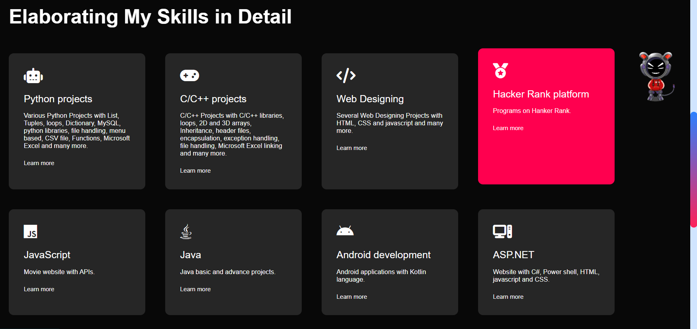
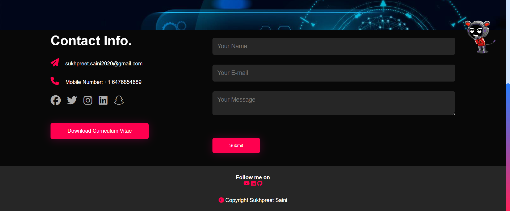

# 🌟 ASSIGNMENT01 - Personal Portfolio 🌟

Welcome to my Personal Portfolio site! This project showcases my skills, projects, and achievements. It's built using Node.js with Express and Handlebars (HBS) as the view engine. The site is divided into four main sections: Home, About Me, Projects, and Contact Me.

## 📑 Table of Contents

- Description
- Live Site
- Usage
- External Sources

## 📝 Description

This application is designed as a personal portfolio website to highlight my skills, projects, and achievements. It includes the following pages:

- **🏠 Home**: An introduction to myself and my role as a computer programmer.



- **🙋‍♂️ About Me**: A detailed description of my background, skills, experience, and education.



- **💼 Projects**: A list of various projects I have worked on, including Python, C/C++, web design, and more.



- **📞 Contact Me**: A page where visitors can reach out to me through a contact form.

#### NOTE :- I have also tried making a working contact me form which is connected with my Google Sheets. I will get all the details of the users who fill the form.




## 🌐 Live Site

Check out the live site [here](https://personal-portfolio-t85p.onrender.com) :- https://personal-portfolio-t85p.onrender.com.

## 🚀 Usage

To run this application locally:

1. Clone the repository:

    ```bash
    git clone https://github.com/SUKH2022/COMP2068JSFrameworks/ASSIGNMENT01.git
    ```

2. Install the dependencies:

    ```bash
    cd ASSIGNMENT01
    npm install
    ```

3. Start the server:

    ```bash
    npm start
    ```

4. Open your browser and navigate to `http://localhost:3000` to view the site.

## 🔗 External Sources

This project utilizes the following external sources, templates, and themes:

- **Font Awesome**: Used for icons throughout the site. [Font Awesome](https://fontawesome.com/)
- **Google Fonts**: For typography styles. [Google Fonts](https://fonts.google.com/)
- **Handlebars (HBS)**: As the templating engine. [Handlebars.js](https://handlebarsjs.com/)

